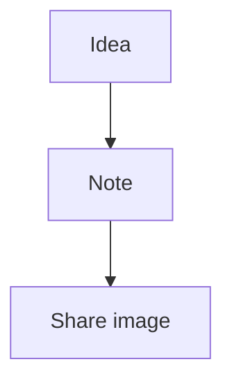

# Smarticky Mermaid + Drawio Implementation Plan

> **For agentic workers:** REQUIRED SUB-SKILL: Use superpowers:subagent-driven-development (recommended) or superpowers:executing-plans to implement this plan task-by-task. Steps use checkbox (`- [ ]`) syntax for tracking.

**Goal:** Add first-version diagram rendering for Mermaid and drawio Markdown fences in the Web UI and browser-generated share images.

**Architecture:** Keep notes stored as Markdown source. `renderMarkdown()` emits safe diagram placeholders for supported fenced code blocks, then a front-end diagram runtime replaces those placeholders with rendered SVG/HTML and reports settle state to the share image dialog. MCP PNG generation remains text-only and documents that diagram rendering is not supported there yet.

**Tech Stack:** Svelte 5, Vite 6, TypeScript, Marked 18, DOMPurify, Mermaid 11.15.0 (MIT), `@markdown-viewer/drawio2svg` 1.5.1 (LGPL-3.0-only, accepted), Vitest 4.1.9, jsdom 29.1.1.

## Global Constraints

- First version supports `mermaid` and `drawio` fences only.
- PlantUML is deferred and must not be included in first-version implementation.
- No server-side/headless renderer in first version.
- MCP image generation remains backed by `internal/shareimage/service.go` and remains text-only for diagrams.
- Do not copy implementation code from `/home/czyt/code/go/markdown-viewer-extension`.
- `@markdown-viewer/drawio2svg` LGPL-3.0-only dependency is acceptable for this project.
- Diagram source is untrusted user input and rendered output must be sanitized before DOM insertion.
- External network calls are not allowed for diagram rendering by default.
- Preserve note database schema and stored Markdown content.

---

## File Structure

- Modify `web/app/package.json`: add diagram and test dependencies plus a `test` script.
- Modify `web/app/package-lock.json`: generated by `npm install`.
- Modify `web/app/vite.config.ts`: allow Vitest config and prebundle diagram dependencies.
- Create `web/app/src/lib/markdown/diagrams/types.ts`: shared diagram type contracts.
- Create `web/app/src/lib/markdown/diagrams/fences.ts`: normalize fenced code languages and identify supported diagram types.
- Create `web/app/src/lib/markdown/diagrams/placeholders.ts`: encode/decode diagram source and emit placeholder HTML.
- Create `web/app/src/lib/markdown/diagrams/registry.ts`: dispatch to concrete renderers; expose a test override.
- Create `web/app/src/lib/markdown/diagrams/runtime.ts`: Svelte action that replaces placeholders with rendered diagrams and reports settle state.
- Create `web/app/src/lib/markdown/diagrams/wait.ts`: wait helper used before share image capture.
- Create `web/app/src/lib/markdown/diagrams/mermaid.ts`: Mermaid renderer.
- Create `web/app/src/lib/markdown/diagrams/drawio.ts`: drawio XML to SVG renderer.
- Modify `web/app/src/lib/markdown/render.ts`: emit placeholders for supported fences and keep stripping behavior sane.
- Create `web/app/src/lib/components/common/RenderedMarkdown.svelte`: reusable rendered Markdown root that activates diagram rendering.
- Modify `web/app/src/lib/components/editor/ShareImageDialog.svelte`: use `RenderedMarkdown`, wait for export diagrams before capture, disable buttons while export diagrams render.
- Modify `web/app/src/lib/styles/global.css`: diagram block, loading, and error styles for normal/share/export surfaces.
- Modify `internal/mcp/server.go`: update MCP image tool description to say diagrams are not rendered in MCP images yet.
- Modify `internal/mcp/auth_test.go`: add a focused test for the MCP diagram limitation wording.
- Modify `README.md`: document Web/share-image support and MCP limitation.

---

### Task 1: Add Dependencies And Test Harness

**Files:**
- Modify: `web/app/package.json`
- Modify: `web/app/package-lock.json`
- Modify: `web/app/vite.config.ts`

**Interfaces:**
- Produces: `npm run test -- --run` runs Vitest in jsdom.
- Produces: `mermaid@11.15.0` and `@markdown-viewer/drawio2svg@1.5.1` are available to TypeScript modules.

- [ ] **Step 1: Install runtime and test dependencies**

Run:

```bash
cd web/app
npm install mermaid@11.15.0 @markdown-viewer/drawio2svg@1.5.1
npm install -D vitest@4.1.9 jsdom@29.1.1
```

Expected:

```text
added ... packages
found 0 vulnerabilities
```

If npm reports peer warnings, keep them only if `npm run build`, `npm run check`, and `npm run test -- --run` pass at the end of this task.

- [ ] **Step 2: Add test scripts**

Modify `web/app/package.json` so the `scripts` block includes:

```json
{
  "dev": "vite --host 0.0.0.0",
  "build": "vite build && node scripts/normalize-generated-assets.mjs",
  "check": "svelte-check --tsconfig ./tsconfig.json",
  "preview": "vite preview --host 0.0.0.0",
  "test": "vitest run",
  "test:watch": "vitest"
}
```

Keep existing dependency versions unchanged except for the four packages installed in Step 1.

- [ ] **Step 3: Configure Vite/Vitest**

Modify `web/app/vite.config.ts` to:

```ts
/// <reference types="vitest/config" />

import { svelte } from "@sveltejs/vite-plugin-svelte";
import { defineConfig } from "vite";

export default defineConfig({
  plugins: [svelte()],
  base: "/static/app/",
  optimizeDeps: {
    include: ["mermaid", "@markdown-viewer/drawio2svg"],
  },
  test: {
    environment: "jsdom",
    include: ["src/**/*.test.ts"],
  },
  build: {
    outDir: "../static/app",
    emptyOutDir: true,
    rollupOptions: {
      output: {
        entryFileNames: "assets/index.js",
        chunkFileNames: "assets/[name].js",
        assetFileNames: (assetInfo) => {
          if (assetInfo.name?.endsWith(".css")) return "assets/index.css";
          return "assets/[name][extname]";
        },
        manualChunks: (id) => {
          if (
            id.includes("/node_modules/@codemirror/") ||
            id.includes("/node_modules/@lezer/") ||
            id.includes("/node_modules/crelt/") ||
            id.includes("/node_modules/style-mod/")
          ) {
            return "editor";
          }
        },
      },
    },
  },
});
```

- [ ] **Step 4: Verify harness**

Run:

```bash
cd web/app
npm run test -- --run
npm run check
```

Expected:

```text
No test files found
```

for the first command is acceptable at this point. `svelte-check` must exit successfully.

- [ ] **Step 5: Commit**

```bash
git add web/app/package.json web/app/package-lock.json web/app/vite.config.ts
git commit -m "Prepare the web app for diagram rendering tests" -m "Add the accepted diagram dependencies and a minimal Vitest/jsdom harness so the Markdown renderer can be changed behind focused regression tests.

Constraint: First diagram release targets Mermaid and drawio only
Constraint: drawio dependency is LGPL-3.0-only and accepted for this project
Confidence: high
Scope-risk: narrow
Tested: npm run test -- --run; npm run check
Not-tested: Runtime diagram rendering, added in later tasks"
```

---

### Task 2: Emit Safe Diagram Placeholders From Markdown

**Files:**
- Create: `web/app/src/lib/markdown/diagrams/types.ts`
- Create: `web/app/src/lib/markdown/diagrams/fences.ts`
- Create: `web/app/src/lib/markdown/diagrams/placeholders.ts`
- Modify: `web/app/src/lib/markdown/render.ts`
- Test: `web/app/src/lib/markdown/diagrams/fences.test.ts`
- Test: `web/app/src/lib/markdown/render.test.ts`

**Interfaces:**
- Produces: `type DiagramType = "mermaid" | "drawio"`.
- Produces: `normalizeDiagramType(language: string | undefined | null): DiagramType | null`.
- Produces: `createDiagramPlaceholder(type: DiagramType, source: string): string`.
- Produces: `decodeDiagramSource(encoded: string): string`.
- Produces: `stripDiagramFences(markdown: string): string`.
- Consumes: `renderMarkdown(markdown: string): string`.

- [ ] **Step 1: Write failing fence tests**

Create `web/app/src/lib/markdown/diagrams/fences.test.ts`:

```ts
import { describe, expect, it } from "vitest";
import { normalizeDiagramType, stripDiagramFences } from "./fences";

describe("normalizeDiagramType", () => {
  it("recognizes first-version diagram fence languages", () => {
    expect(normalizeDiagramType("mermaid")).toBe("mermaid");
    expect(normalizeDiagramType("MERMAID")).toBe("mermaid");
    expect(normalizeDiagramType("drawio")).toBe("drawio");
    expect(normalizeDiagramType("draw.io")).toBe("drawio");
  });

  it("does not recognize deferred or unsupported diagram languages", () => {
    expect(normalizeDiagramType("plantuml")).toBeNull();
    expect(normalizeDiagramType("puml")).toBeNull();
    expect(normalizeDiagramType("dot")).toBeNull();
    expect(normalizeDiagramType("")).toBeNull();
    expect(normalizeDiagramType(undefined)).toBeNull();
  });
});

describe("stripDiagramFences", () => {
  it("removes first-version diagram source from plain text extraction", () => {
    const markdown = [
      "Before",
      "```mermaid",
      "flowchart TD",
      "A --> B",
      "```",
      "Middle",
      "```drawio",
      "<mxfile></mxfile>",
      "```",
      "After",
    ].join("\n");

    expect(stripDiagramFences(markdown)).toBe(["Before", "Middle", "After"].join("\n"));
  });

  it("leaves deferred PlantUML fences in plain text extraction", () => {
    const markdown = ["```plantuml", "@startuml", "A -> B", "@enduml", "```"].join("\n");

    expect(stripDiagramFences(markdown)).toContain("@startuml");
  });
});
```

- [ ] **Step 2: Write failing Markdown rendering tests**

Create `web/app/src/lib/markdown/render.test.ts`:

```ts
import { describe, expect, it } from "vitest";
import { decodeDiagramSource } from "./diagrams/placeholders";
import { renderMarkdown, stripMarkdown } from "./render";

function getPlaceholder(html: string): HTMLElement {
  const root = document.createElement("div");
  root.innerHTML = html;
  const node = root.querySelector<HTMLElement>("[data-diagram-placeholder='true']");
  if (!node) throw new Error("diagram placeholder missing");
  return node;
}

describe("renderMarkdown diagram placeholders", () => {
  it("emits a safe Mermaid placeholder", () => {
    const source = "flowchart TD\n  A --> B";
    const html = renderMarkdown(`\`\`\`mermaid\n${source}\n\`\`\``);
    const node = getPlaceholder(html);

    expect(node.dataset.diagramType).toBe("mermaid");
    expect(decodeDiagramSource(node.dataset.diagramSource || "")).toBe(source);
    expect(html).not.toContain("<script");
  });

  it("emits a safe drawio placeholder", () => {
    const source = "<mxfile><diagram>safe</diagram></mxfile>";
    const html = renderMarkdown(`\`\`\`drawio\n${source}\n\`\`\``);
    const node = getPlaceholder(html);

    expect(node.dataset.diagramType).toBe("drawio");
    expect(decodeDiagramSource(node.dataset.diagramSource || "")).toBe(source);
  });

  it("keeps unsupported diagram fences as normal code blocks", () => {
    const html = renderMarkdown("```plantuml\n@startuml\nA -> B\n@enduml\n```");

    expect(html).toContain("<pre>");
    expect(html).toContain("@startuml");
    expect(html).not.toContain("data-diagram-placeholder");
  });

  it("keeps empty supported fences as normal code blocks", () => {
    const html = renderMarkdown("```mermaid\n\n```");

    expect(html).toContain("<pre>");
    expect(html).not.toContain("data-diagram-placeholder");
  });
});

describe("stripMarkdown", () => {
  it("does not count Mermaid or drawio source as visible prose", () => {
    const markdown = ["Visible", "```mermaid", "flowchart TD", "A --> B", "```"].join("\n");

    expect(stripMarkdown(markdown)).toBe("Visible");
  });
});
```

- [ ] **Step 3: Run tests and verify they fail**

Run:

```bash
cd web/app
npm run test -- --run src/lib/markdown/diagrams/fences.test.ts src/lib/markdown/render.test.ts
```

Expected: FAIL with missing module/function errors.

- [ ] **Step 4: Add diagram types**

Create `web/app/src/lib/markdown/diagrams/types.ts`:

```ts
export type DiagramType = "mermaid" | "drawio";
export type DiagramTheme = "light" | "dark";

export interface DiagramRenderRequest {
  type: DiagramType;
  source: string;
  theme: DiagramTheme;
}

export interface DiagramRenderResult {
  html: string;
}

export interface DiagramRenderer {
  type: DiagramType;
  render(request: DiagramRenderRequest): Promise<DiagramRenderResult>;
}

export interface DiagramRuntimeState {
  pending: number;
  total: number;
  settled: boolean;
}
```

- [ ] **Step 5: Add fence normalization**

Create `web/app/src/lib/markdown/diagrams/fences.ts`:

```ts
import type { DiagramType } from "./types";

const diagramFencePattern =
  /```([^\n`]*)\n([\s\S]*?)```/g;

export function normalizeDiagramType(language: string | null | undefined): DiagramType | null {
  const normalized = (language || "").trim().toLowerCase();
  if (normalized === "mermaid") return "mermaid";
  if (normalized === "drawio" || normalized === "draw.io") return "drawio";
  return null;
}

export function stripDiagramFences(markdown: string): string {
  return markdown
    .replace(diagramFencePattern, (match, language) => {
      return normalizeDiagramType(language) ? "" : match;
    })
    .replace(/\n{3,}/g, "\n\n")
    .trim();
}
```

- [ ] **Step 6: Add placeholder helpers**

Create `web/app/src/lib/markdown/diagrams/placeholders.ts`:

```ts
import type { DiagramType } from "./types";

export function encodeDiagramSource(source: string): string {
  return btoa(unescape(encodeURIComponent(source)));
}

export function decodeDiagramSource(encoded: string): string {
  return decodeURIComponent(escape(atob(encoded)));
}

export function createDiagramPlaceholder(type: DiagramType, source: string): string {
  const encodedSource = encodeDiagramSource(source);
  const label = type === "mermaid" ? "Mermaid" : "drawio";

  return [
    `<div class="diagram-block diagram-block--${type}" data-diagram-placeholder="true" data-diagram-type="${type}" data-diagram-source="${encodedSource}">`,
    `<div class="diagram-loading" aria-live="polite">Rendering ${label} diagram...</div>`,
    `</div>`,
  ].join("");
}
```

- [ ] **Step 7: Modify Markdown renderer**

Modify `web/app/src/lib/markdown/render.ts`:

```ts
import DOMPurify from "dompurify";
import { Marked, Renderer, type Tokens } from "marked";
import markedKatex from "marked-katex-extension";
import { normalizeDiagramType, stripDiagramFences } from "./diagrams/fences";
import { createDiagramPlaceholder } from "./diagrams/placeholders";

const markedOptions = {
  async: false,
  breaks: false,
  gfm: true,
} as const;

const fallbackRenderer = new Renderer();

const diagramRenderer = {
  code(token: Tokens.Code): string | false {
    const diagramType = normalizeDiagramType(token.lang);
    if (!diagramType || !token.text.trim()) return false;
    return createDiagramPlaceholder(diagramType, token.text.trim());
  },
} satisfies Partial<Renderer>;

const markdownRenderer = new Marked(
  markedOptions,
  markedKatex({
    throwOnError: false,
  }),
  {
    renderer: {
      code(token: Tokens.Code): string {
        return diagramRenderer.code(token) || fallbackRenderer.code(token);
      },
    },
  },
);

export function renderMarkdown(markdown: string): string {
  return DOMPurify.sanitize(markdownRenderer.parse(markdown, markedOptions));
}

export function stripMarkdown(markdown: string): string {
  const container = document.createElement("div");
  container.innerHTML = renderMarkdown(stripDiagramFences(markdown));
  return container.textContent?.trim() ?? "";
}
```

- [ ] **Step 8: Run tests and verify pass**

Run:

```bash
cd web/app
npm run test -- --run src/lib/markdown/diagrams/fences.test.ts src/lib/markdown/render.test.ts
npm run check
```

Expected: PASS.

- [ ] **Step 9: Commit**

```bash
git add web/app/src/lib/markdown/render.ts web/app/src/lib/markdown/render.test.ts web/app/src/lib/markdown/diagrams/types.ts web/app/src/lib/markdown/diagrams/fences.ts web/app/src/lib/markdown/diagrams/fences.test.ts web/app/src/lib/markdown/diagrams/placeholders.ts
git commit -m "Render diagram fences as safe Markdown placeholders" -m "Mermaid and drawio fences now become inert placeholders that a front-end runtime can resolve asynchronously. Unsupported and empty fences still render as ordinary code blocks, and plain-text extraction ignores first-version diagram source.

Constraint: PlantUML remains unsupported in first version
Confidence: high
Scope-risk: narrow
Tested: npm run test -- --run src/lib/markdown/diagrams/fences.test.ts src/lib/markdown/render.test.ts; npm run check
Not-tested: Concrete Mermaid/drawio rendering, added in later tasks"
```

---

### Task 3: Add Diagram Runtime And Export Wait Helper

**Files:**
- Create: `web/app/src/lib/markdown/diagrams/registry.ts`
- Create: `web/app/src/lib/markdown/diagrams/runtime.ts`
- Create: `web/app/src/lib/markdown/diagrams/wait.ts`
- Test: `web/app/src/lib/markdown/diagrams/runtime.test.ts`
- Test: `web/app/src/lib/markdown/diagrams/wait.test.ts`

**Interfaces:**
- Consumes: `decodeDiagramSource(encoded: string): string`.
- Produces: `renderDiagram(request: DiagramRenderRequest): Promise<DiagramRenderResult>`.
- Produces: `setDiagramRendererForTest(type: DiagramType, renderer: DiagramRenderer | null): void`.
- Produces: `diagramRuntime(node: HTMLElement, options: DiagramRuntimeOptions): { update(options): void; destroy(): void }`.
- Produces: `waitForDiagramSettle(getState: () => DiagramRuntimeState, timeoutMs?: number): Promise<void>`.

- [ ] **Step 1: Write failing runtime tests**

Create `web/app/src/lib/markdown/diagrams/runtime.test.ts`:

```ts
import { afterEach, describe, expect, it } from "vitest";
import { createDiagramPlaceholder } from "./placeholders";
import { diagramRuntime } from "./runtime";
import { setDiagramRendererForTest } from "./registry";
import type { DiagramRuntimeState } from "./types";

describe("diagramRuntime", () => {
  afterEach(() => {
    setDiagramRendererForTest("mermaid", null);
    setDiagramRendererForTest("drawio", null);
  });

  it("replaces placeholders with rendered HTML and reports settle state", async () => {
    const root = document.createElement("div");
    root.innerHTML = createDiagramPlaceholder("mermaid", "flowchart TD\nA --> B");
    const states: DiagramRuntimeState[] = [];

    setDiagramRendererForTest("mermaid", {
      type: "mermaid",
      async render() {
        return { html: "<svg data-rendered='mermaid'></svg>" };
      },
    });

    diagramRuntime(root, {
      theme: "light",
      onStateChange: (state) => states.push(state),
    });

    await new Promise((resolve) => setTimeout(resolve, 0));

    expect(root.querySelector("[data-rendered='mermaid']")).toBeTruthy();
    expect(root.querySelector("[data-diagram-placeholder='true']")).toBeNull();
    expect(states.at(-1)).toEqual({ pending: 0, total: 1, settled: true });
  });

  it("renders an inline error when rendering fails", async () => {
    const root = document.createElement("div");
    root.innerHTML = createDiagramPlaceholder("drawio", "<mxfile></mxfile>");

    setDiagramRendererForTest("drawio", {
      type: "drawio",
      async render() {
        throw new Error("invalid drawio xml");
      },
    });

    diagramRuntime(root, { theme: "light" });

    await new Promise((resolve) => setTimeout(resolve, 0));

    const error = root.querySelector(".diagram-error");
    expect(error?.textContent).toContain("drawio");
    expect(error?.textContent).toContain("invalid drawio xml");
  });
});
```

- [ ] **Step 2: Write failing wait helper tests**

Create `web/app/src/lib/markdown/diagrams/wait.test.ts`:

```ts
import { describe, expect, it } from "vitest";
import { waitForDiagramSettle } from "./wait";
import type { DiagramRuntimeState } from "./types";

describe("waitForDiagramSettle", () => {
  it("resolves immediately when diagrams are settled", async () => {
    const state: DiagramRuntimeState = { pending: 0, total: 1, settled: true };

    await expect(waitForDiagramSettle(() => state, 20)).resolves.toBeUndefined();
  });

  it("waits until pending diagrams settle", async () => {
    const state: DiagramRuntimeState = { pending: 1, total: 1, settled: false };
    setTimeout(() => {
      state.pending = 0;
      state.settled = true;
    }, 5);

    await expect(waitForDiagramSettle(() => state, 50)).resolves.toBeUndefined();
  });

  it("rejects after timeout", async () => {
    const state: DiagramRuntimeState = { pending: 1, total: 1, settled: false };

    await expect(waitForDiagramSettle(() => state, 5)).rejects.toThrow("Diagram rendering timed out");
  });
});
```

- [ ] **Step 3: Run tests and verify they fail**

Run:

```bash
cd web/app
npm run test -- --run src/lib/markdown/diagrams/runtime.test.ts src/lib/markdown/diagrams/wait.test.ts
```

Expected: FAIL with missing module/function errors.

- [ ] **Step 4: Add registry**

Create `web/app/src/lib/markdown/diagrams/registry.ts`:

```ts
import { renderDrawioDiagram } from "./drawio";
import { renderMermaidDiagram } from "./mermaid";
import type { DiagramRenderRequest, DiagramRenderResult, DiagramRenderer, DiagramType } from "./types";

const rendererOverrides = new Map<DiagramType, DiagramRenderer>();

const defaultRenderers: Record<DiagramType, DiagramRenderer> = {
  mermaid: {
    type: "mermaid",
    render: renderMermaidDiagram,
  },
  drawio: {
    type: "drawio",
    render: renderDrawioDiagram,
  },
};

export function setDiagramRendererForTest(type: DiagramType, renderer: DiagramRenderer | null): void {
  if (renderer) {
    rendererOverrides.set(type, renderer);
    return;
  }
  rendererOverrides.delete(type);
}

export async function renderDiagram(request: DiagramRenderRequest): Promise<DiagramRenderResult> {
  const renderer = rendererOverrides.get(request.type) ?? defaultRenderers[request.type];
  return renderer.render(request);
}
```

This imports files created in later tasks. If this task is implemented before concrete renderers exist, create temporary stubs in `mermaid.ts` and `drawio.ts`:

```ts
import type { DiagramRenderRequest, DiagramRenderResult } from "./types";

export async function renderMermaidDiagram(_request: DiagramRenderRequest): Promise<DiagramRenderResult> {
  throw new Error("Mermaid renderer is not available yet");
}
```

and:

```ts
import type { DiagramRenderRequest, DiagramRenderResult } from "./types";

export async function renderDrawioDiagram(_request: DiagramRenderRequest): Promise<DiagramRenderResult> {
  throw new Error("drawio renderer is not available yet");
}
```

The later renderer tasks replace those stubs.

- [ ] **Step 5: Add runtime**

Create `web/app/src/lib/markdown/diagrams/runtime.ts`:

```ts
import { decodeDiagramSource } from "./placeholders";
import { renderDiagram } from "./registry";
import type { DiagramRuntimeState, DiagramTheme, DiagramType } from "./types";

export interface DiagramRuntimeOptions {
  theme: DiagramTheme;
  onStateChange?: (state: DiagramRuntimeState) => void;
}

function emitState(options: DiagramRuntimeOptions, pending: number, total: number): void {
  options.onStateChange?.({
    pending,
    total,
    settled: pending === 0,
  });
}

function errorHtml(type: DiagramType, error: unknown): string {
  const message = error instanceof Error ? error.message : String(error);
  const safeMessage = message.replace(/[&<>"']/g, (char) => {
    const entities: Record<string, string> = {
      "&": "&amp;",
      "<": "&lt;",
      ">": "&gt;",
      '"': "&quot;",
      "'": "&#039;",
    };
    return entities[char] || char;
  });
  return `<pre class="diagram-error">Failed to render ${type} diagram: ${safeMessage}</pre>`;
}

async function renderRoot(node: HTMLElement, options: DiagramRuntimeOptions, runToken: { active: boolean }): Promise<void> {
  const placeholders = Array.from(
    node.querySelectorAll<HTMLElement>("[data-diagram-placeholder='true']"),
  );
  const total = placeholders.length;
  let pending = total;
  emitState(options, pending, total);

  await Promise.all(
    placeholders.map(async (placeholder) => {
      const type = placeholder.dataset.diagramType as DiagramType | undefined;
      const encodedSource = placeholder.dataset.diagramSource || "";
      if (!type || (type !== "mermaid" && type !== "drawio")) {
        pending -= 1;
        emitState(options, pending, total);
        return;
      }

      try {
        const source = decodeDiagramSource(encodedSource);
        const result = await renderDiagram({
          type,
          source,
          theme: options.theme,
        });
        if (runToken.active) {
          placeholder.outerHTML = result.html;
        }
      } catch (error) {
        if (runToken.active) {
          placeholder.outerHTML = errorHtml(type, error);
        }
      } finally {
        pending -= 1;
        if (runToken.active) {
          emitState(options, pending, total);
        }
      }
    }),
  );

  if (runToken.active) {
    emitState(options, 0, total);
  }
}

export function diagramRuntime(node: HTMLElement, initialOptions: DiagramRuntimeOptions) {
  let options = initialOptions;
  let runToken = { active: true };

  function scheduleRender(): void {
    runToken.active = false;
    runToken = { active: true };
    queueMicrotask(() => {
      void renderRoot(node, options, runToken);
    });
  }

  scheduleRender();

  return {
    update(nextOptions: DiagramRuntimeOptions): void {
      options = nextOptions;
      scheduleRender();
    },
    destroy(): void {
      runToken.active = false;
    },
  };
}
```

- [ ] **Step 6: Add wait helper**

Create `web/app/src/lib/markdown/diagrams/wait.ts`:

```ts
import type { DiagramRuntimeState } from "./types";

export async function waitForDiagramSettle(
  getState: () => DiagramRuntimeState,
  timeoutMs = 5000,
): Promise<void> {
  const start = performance.now();

  while (!getState().settled) {
    if (performance.now() - start > timeoutMs) {
      throw new Error("Diagram rendering timed out");
    }
    await new Promise((resolve) => setTimeout(resolve, 16));
  }
}
```

- [ ] **Step 7: Run tests and verify pass**

Run:

```bash
cd web/app
npm run test -- --run src/lib/markdown/diagrams/runtime.test.ts src/lib/markdown/diagrams/wait.test.ts
npm run check
```

Expected: PASS.

- [ ] **Step 8: Commit**

```bash
git add web/app/src/lib/markdown/diagrams/registry.ts web/app/src/lib/markdown/diagrams/runtime.ts web/app/src/lib/markdown/diagrams/runtime.test.ts web/app/src/lib/markdown/diagrams/wait.ts web/app/src/lib/markdown/diagrams/wait.test.ts web/app/src/lib/markdown/diagrams/mermaid.ts web/app/src/lib/markdown/diagrams/drawio.ts
git commit -m "Add the asynchronous diagram rendering runtime" -m "Introduce the small front-end runtime that resolves inert Markdown diagram placeholders, reports settle state, and keeps failures inline so share image export can capture either the rendered diagram or a visible error.

Constraint: Concrete Mermaid and drawio renderers are wired through replaceable registry entries
Confidence: high
Scope-risk: moderate
Tested: npm run test -- --run src/lib/markdown/diagrams/runtime.test.ts src/lib/markdown/diagrams/wait.test.ts; npm run check
Not-tested: Concrete Mermaid/drawio renderer packages"
```

---

### Task 4: Wire Rendered Markdown Into Share Image Export

**Files:**
- Create: `web/app/src/lib/components/common/RenderedMarkdown.svelte`
- Modify: `web/app/src/lib/components/editor/ShareImageDialog.svelte`
- Test: `web/app/src/lib/markdown/diagrams/wait.test.ts`

**Interfaces:**
- Consumes: `diagramRuntime`.
- Consumes: `waitForDiagramSettle`.
- Produces: `RenderedMarkdown` component with props `html`, `theme`, `className`, `onDiagramState`.

- [ ] **Step 1: Add a component wrapper**

Create `web/app/src/lib/components/common/RenderedMarkdown.svelte`:

```svelte
<script lang="ts">
  import { diagramRuntime } from "../../markdown/diagrams/runtime";
  import type { DiagramRuntimeState, DiagramTheme } from "../../markdown/diagrams/types";

  export let html = "";
  export let theme: DiagramTheme = "light";
  export let className = "";
  export let onDiagramState: (state: DiagramRuntimeState) => void = () => {};

  $: runtimeOptions = {
    theme,
    onStateChange: onDiagramState,
  };
</script>

<div class={className} use:diagramRuntime={runtimeOptions}>
  {@html html}
</div>
```

- [ ] **Step 2: Update share dialog state and imports**

Modify imports in `web/app/src/lib/components/editor/ShareImageDialog.svelte`:

```ts
  import { toBlob, toPng } from "html-to-image";
  import { onMount, tick } from "svelte";
  import { waitForDiagramSettle } from "../../markdown/diagrams/wait";
  import type { DiagramRuntimeState, DiagramTheme } from "../../markdown/diagrams/types";
  import { renderMarkdown, stripMarkdown } from "../../markdown/render";
  import { notify } from "../../stores/dialogs";
  import { preferencesStore, t, type MessageKey } from "../../stores/preferences";
  import RenderedMarkdown from "../common/RenderedMarkdown.svelte";
```

Add state near `let imageBusy = false;`:

```ts
  const settledDiagramState: DiagramRuntimeState = {
    pending: 0,
    total: 0,
    settled: true,
  };

  let exportDiagramState: DiagramRuntimeState = { ...settledDiagramState };
```

Add reactive theme:

```ts
  $: diagramTheme = (themeID === "night" ? "dark" : "light") satisfies DiagramTheme;
  $: exportBlocked = imageBusy || !exportDiagramState.settled;
```

Add setter:

```ts
  function setExportDiagramState(state: DiagramRuntimeState): void {
    exportDiagramState = state;
  }
```

- [ ] **Step 3: Wait before export capture**

Modify `exportOptions()` in `ShareImageDialog.svelte`:

```ts
  async function exportOptions() {
    await tick();
    await waitForDiagramSettle(() => exportDiagramState);
    await tick();
    if (!exportTarget) throw new Error("Share image target unavailable");

    const width = exportTarget.scrollWidth;
    const height = exportTarget.scrollHeight;
    return {
      backgroundColor: activeTheme.background,
      cacheBust: true,
      height,
      pixelRatio: canvasScaleFor(width, height),
      width,
    };
  }
```

- [ ] **Step 4: Replace rendered markdown roots**

Replace both share Markdown blocks in `ShareImageDialog.svelte`.

Visible preview:

```svelte
            <RenderedMarkdown
              className="share-preview__markdown"
              html={renderedContent}
              theme={diagramTheme}
            />
```

Hidden export target:

```svelte
      <RenderedMarkdown
        className="share-preview__markdown"
        html={renderedContent}
        theme={diagramTheme}
        onDiagramState={setExportDiagramState}
      />
```

- [ ] **Step 5: Disable export actions while export diagrams render**

Modify action buttons:

```svelte
          <button type="button" disabled={exportBlocked} on:click={copyImage}>
            {t("copyImage", $preferencesStore.language)}
          </button>
          <button class="primary" type="button" disabled={exportBlocked} on:click={downloadImage}>
            {t("downloadPng", $preferencesStore.language)}
          </button>
```

- [ ] **Step 6: Verify**

Run:

```bash
cd web/app
npm run test -- --run
npm run check
npm run build
```

Expected: PASS.

- [ ] **Step 7: Commit**

```bash
git add web/app/src/lib/components/common/RenderedMarkdown.svelte web/app/src/lib/components/editor/ShareImageDialog.svelte
git commit -m "Wait for diagrams before browser share image export" -m "Route share Markdown through the diagram runtime and block copy/download until the hidden export DOM has settled, so html-to-image captures rendered diagrams or their inline error blocks.

Constraint: Browser share image export is first-version diagram export
Confidence: high
Scope-risk: moderate
Tested: npm run test -- --run; npm run check; npm run build
Not-tested: Real Mermaid/drawio rendering, added in later tasks"
```

---

### Task 5: Implement Mermaid Rendering

**Files:**
- Modify: `web/app/src/lib/markdown/diagrams/mermaid.ts`
- Test: `web/app/src/lib/markdown/diagrams/mermaid.test.ts`
- Modify: `web/app/src/lib/styles/global.css`

**Interfaces:**
- Consumes: `DiagramRenderRequest`.
- Produces: `renderMermaidDiagram(request: DiagramRenderRequest): Promise<DiagramRenderResult>`.

- [ ] **Step 1: Write failing Mermaid renderer tests**

Create `web/app/src/lib/markdown/diagrams/mermaid.test.ts`:

```ts
import { beforeEach, describe, expect, it, vi } from "vitest";
import { renderMermaidDiagram } from "./mermaid";

const renderMock = vi.fn();
const initializeMock = vi.fn();
const parseMock = vi.fn();

vi.mock("mermaid", () => ({
  default: {
    initialize: initializeMock,
    parse: parseMock,
    render: renderMock,
  },
}));

describe("renderMermaidDiagram", () => {
  beforeEach(() => {
    initializeMock.mockReset();
    parseMock.mockReset().mockResolvedValue(true);
    renderMock.mockReset().mockResolvedValue({
      svg: "<svg><g><text>diagram</text></g></svg>",
    });
  });

  it("renders Mermaid source as sanitized SVG HTML", async () => {
    const result = await renderMermaidDiagram({
      type: "mermaid",
      source: "flowchart TD\nA --> B",
      theme: "light",
    });

    expect(initializeMock).toHaveBeenCalledWith(
      expect.objectContaining({
        startOnLoad: false,
        securityLevel: "strict",
        theme: "default",
      }),
    );
    expect(parseMock).toHaveBeenCalledWith("flowchart TD\nA --> B");
    expect(renderMock).toHaveBeenCalled();
    expect(result.html).toContain("diagram-render diagram-render--mermaid");
    expect(result.html).toContain("<svg");
  });

  it("uses Mermaid dark theme for dark diagram theme", async () => {
    await renderMermaidDiagram({
      type: "mermaid",
      source: "sequenceDiagram\nA->>B: hi",
      theme: "dark",
    });

    expect(initializeMock).toHaveBeenCalledWith(
      expect.objectContaining({
        theme: "dark",
      }),
    );
  });

  it("removes script tags from Mermaid output", async () => {
    renderMock.mockResolvedValue({
      svg: "<svg><script>alert(1)</script><text>safe</text></svg>",
    });

    const result = await renderMermaidDiagram({
      type: "mermaid",
      source: "flowchart TD\nA --> B",
      theme: "light",
    });

    expect(result.html).not.toContain("<script");
    expect(result.html).toContain("safe");
  });
});
```

- [ ] **Step 2: Run tests and verify they fail**

Run:

```bash
cd web/app
npm run test -- --run src/lib/markdown/diagrams/mermaid.test.ts
```

Expected: FAIL because the renderer stub throws.

- [ ] **Step 3: Implement Mermaid renderer**

Replace `web/app/src/lib/markdown/diagrams/mermaid.ts`:

```ts
import DOMPurify from "dompurify";
import mermaid from "mermaid";
import type { DiagramRenderRequest, DiagramRenderResult, DiagramTheme } from "./types";

let renderSequence = 0;

function configureMermaid(theme: DiagramTheme): void {
  mermaid.initialize({
    startOnLoad: false,
    securityLevel: "strict",
    theme: theme === "dark" ? "dark" : "default",
    themeVariables: {
      background: "transparent",
    },
    flowchart: {
      htmlLabels: false,
      curve: "basis",
    },
  });
}

function sanitizeSvg(svg: string): string {
  return DOMPurify.sanitize(svg, {
    USE_PROFILES: {
      svg: true,
      svgFilters: true,
    },
  });
}

export async function renderMermaidDiagram(
  request: DiagramRenderRequest,
): Promise<DiagramRenderResult> {
  configureMermaid(request.theme);
  await mermaid.parse(request.source);

  renderSequence += 1;
  const id = `smarticky-mermaid-${Date.now()}-${renderSequence}`;
  const { svg } = await mermaid.render(id, request.source);
  const safeSvg = sanitizeSvg(svg);

  return {
    html: `<div class="diagram-render diagram-render--mermaid">${safeSvg}</div>`,
  };
}
```

- [ ] **Step 4: Add diagram styles**

Append to the Markdown/share section of `web/app/src/lib/styles/global.css`:

```css
.diagram-block,
.diagram-render {
  box-sizing: border-box;
  width: 100%;
  max-width: 100%;
  margin: 1em 0;
}

.diagram-loading,
.diagram-error {
  box-sizing: border-box;
  border: 1px solid var(--color-divider, rgba(0, 0, 0, 0.14));
  border-radius: 8px;
  background: var(--sm-code-bg, rgba(0, 0, 0, 0.04));
  color: var(--color-text-secondary, inherit);
  padding: 12px 14px;
  font-family:
    "JetBrains Mono", "Fira Code", "SFMono-Regular", Consolas,
    "Liberation Mono", Menlo, monospace;
  font-size: 13px;
  line-height: 1.55;
  white-space: pre-wrap;
}

.diagram-error {
  border-color: color-mix(in srgb, var(--color-danger, #c7352f) 55%, transparent);
  color: var(--color-danger, #c7352f);
}

.diagram-render {
  overflow-x: auto;
  border: 1px solid var(--color-divider, rgba(0, 0, 0, 0.14));
  border-radius: 8px;
  background: color-mix(in srgb, var(--color-card, #fff) 92%, transparent);
  padding: 14px;
}

.diagram-render svg {
  display: block;
  max-width: 100%;
  height: auto;
  margin: 0 auto;
}

.share-preview__markdown .diagram-loading,
.share-preview__markdown .diagram-error {
  border-color: var(--share-divider);
  background: var(--share-code);
  color: var(--share-code-text);
  font-size: 0.78em;
}

.share-preview__markdown .diagram-error {
  color: var(--share-accent);
}

.share-preview__markdown .diagram-render {
  border-color: var(--share-divider);
  background: var(--share-surface);
  padding: 0.8em;
}
```

- [ ] **Step 5: Run tests and verify pass**

Run:

```bash
cd web/app
npm run test -- --run src/lib/markdown/diagrams/mermaid.test.ts src/lib/markdown/diagrams/runtime.test.ts
npm run check
npm run build
```

Expected: PASS.

- [ ] **Step 6: Manual Web verification**

Run:

```bash
cd web/app
npm run dev -- --port 5173
```

Open the app and create a note containing:

````markdown

````

Expected:

- The note/share preview renders an SVG diagram.
- Downloaded share PNG includes the rendered diagram.
- Invalid Mermaid source displays an inline error block and still allows PNG export.

- [ ] **Step 7: Commit**

```bash
git add web/app/src/lib/markdown/diagrams/mermaid.ts web/app/src/lib/markdown/diagrams/mermaid.test.ts web/app/src/lib/styles/global.css
git commit -m "Render Mermaid diagrams in Markdown notes" -m "Use Mermaid's browser renderer behind the diagram runtime so Mermaid fences render as sanitized SVG and browser share-image export captures the resolved diagram DOM.

Constraint: Mermaid dependency is MIT licensed
Confidence: high
Scope-risk: moderate
Tested: npm run test -- --run src/lib/markdown/diagrams/mermaid.test.ts src/lib/markdown/diagrams/runtime.test.ts; npm run check; npm run build; manual Mermaid share image export
Not-tested: drawio rendering, added separately"
```

---

### Task 6: Implement drawio Rendering

**Files:**
- Modify: `web/app/src/lib/markdown/diagrams/drawio.ts`
- Test: `web/app/src/lib/markdown/diagrams/drawio.test.ts`

**Interfaces:**
- Consumes: `DiagramRenderRequest`.
- Produces: `renderDrawioDiagram(request: DiagramRenderRequest): Promise<DiagramRenderResult>`.

- [ ] **Step 1: Write failing drawio renderer tests**

Create `web/app/src/lib/markdown/diagrams/drawio.test.ts`:

```ts
import { beforeEach, describe, expect, it, vi } from "vitest";
import { renderDrawioDiagram } from "./drawio";

const convertMock = vi.fn();

vi.mock("@markdown-viewer/drawio2svg", () => ({
  convert: convertMock,
}));

describe("renderDrawioDiagram", () => {
  beforeEach(() => {
    convertMock.mockReset().mockReturnValue("<svg><text>drawio</text></svg>");
  });

  it("converts drawio XML to sanitized SVG HTML", async () => {
    const result = await renderDrawioDiagram({
      type: "drawio",
      source: "<mxfile><diagram>safe</diagram></mxfile>",
      theme: "light",
    });

    expect(convertMock).toHaveBeenCalledWith(
      "<mxfile><diagram>safe</diagram></mxfile>",
      expect.objectContaining({
        backgroundColor: null,
        padding: 8,
      }),
    );
    expect(result.html).toContain("diagram-render diagram-render--drawio");
    expect(result.html).toContain("<svg");
    expect(result.html).toContain("drawio");
  });

  it("removes active content from generated SVG", async () => {
    convertMock.mockReturnValue("<svg><script>alert(1)</script><text>safe</text></svg>");

    const result = await renderDrawioDiagram({
      type: "drawio",
      source: "<mxfile></mxfile>",
      theme: "light",
    });

    expect(result.html).not.toContain("<script");
    expect(result.html).toContain("safe");
  });

  it("wraps converter errors with a short message", async () => {
    convertMock.mockImplementation(() => {
      throw new Error("bad mxfile");
    });

    await expect(
      renderDrawioDiagram({
        type: "drawio",
        source: "<mxfile>",
        theme: "light",
      }),
    ).rejects.toThrow("bad mxfile");
  });
});
```

- [ ] **Step 2: Run tests and verify they fail**

Run:

```bash
cd web/app
npm run test -- --run src/lib/markdown/diagrams/drawio.test.ts
```

Expected: FAIL because the renderer stub throws.

- [ ] **Step 3: Implement drawio renderer**

Replace `web/app/src/lib/markdown/diagrams/drawio.ts`:

```ts
import DOMPurify from "dompurify";
import { convert } from "@markdown-viewer/drawio2svg";
import type { DiagramRenderRequest, DiagramRenderResult } from "./types";

function sanitizeSvg(svg: string): string {
  return DOMPurify.sanitize(svg, {
    USE_PROFILES: {
      svg: true,
      svgFilters: true,
    },
  });
}

export async function renderDrawioDiagram(
  request: DiagramRenderRequest,
): Promise<DiagramRenderResult> {
  const svg = convert(request.source, {
    backgroundColor: null,
    padding: 8,
    fontFamily: "-apple-system, BlinkMacSystemFont, Segoe UI, sans-serif",
  });

  return {
    html: `<div class="diagram-render diagram-render--drawio">${sanitizeSvg(svg)}</div>`,
  };
}
```

- [ ] **Step 4: Run tests and verify pass**

Run:

```bash
cd web/app
npm run test -- --run src/lib/markdown/diagrams/drawio.test.ts src/lib/markdown/diagrams/runtime.test.ts
npm run check
npm run build
```

Expected: PASS. If Vite cannot prebundle `@markdown-viewer/drawio2svg` because the package exports TypeScript source, add this to `web/app/vite.config.ts` under `optimizeDeps`:

```ts
  esbuildOptions: {
    loader: {
      ".ts": "ts",
    },
  },
```

Then rerun the commands above.

- [ ] **Step 5: Manual Web verification**

Create a note containing a minimal drawio XML sample:

````markdown
```drawio
<mxfile>
  <diagram name="Page-1">
    <mxGraphModel dx="1000" dy="600" grid="1" gridSize="10" guides="1" tooltips="1" connect="1" arrows="1" fold="1" page="1" pageScale="1" pageWidth="827" pageHeight="1169" math="0" shadow="0">
      <root>
        <mxCell id="0"/>
        <mxCell id="1" parent="0"/>
        <mxCell id="2" value="Smarticky" style="rounded=1;whiteSpace=wrap;html=1;" vertex="1" parent="1">
          <mxGeometry x="120" y="120" width="120" height="60" as="geometry"/>
        </mxCell>
      </root>
    </mxGraphModel>
  </diagram>
</mxfile>
```
````

Expected:

- Web/share preview renders the drawio SVG.
- Downloaded share PNG includes the rendered drawio diagram.
- Invalid XML displays an inline error block and still allows PNG export.

- [ ] **Step 6: Commit**

```bash
git add web/app/src/lib/markdown/diagrams/drawio.ts web/app/src/lib/markdown/diagrams/drawio.test.ts web/app/vite.config.ts
git commit -m "Render drawio diagrams in Markdown notes" -m "Use the accepted LGPL drawio XML converter behind the diagram runtime so drawio fences render as sanitized SVG and are included in browser share-image export.

Constraint: @markdown-viewer/drawio2svg is LGPL-3.0-only and accepted for this project
Rejected: Implement a draw.io editor | first version only renders fenced XML
Confidence: medium
Scope-risk: moderate
Tested: npm run test -- --run src/lib/markdown/diagrams/drawio.test.ts src/lib/markdown/diagrams/runtime.test.ts; npm run check; npm run build; manual drawio share image export
Not-tested: Full draw.io shape/stencil coverage beyond the minimal sample"
```

---

### Task 7: Document MCP Limitation And Run Final Verification

**Files:**
- Modify: `internal/mcp/server.go`
- Modify: `internal/mcp/auth_test.go`
- Modify: `README.md`

**Interfaces:**
- Produces: `generateNoteImageDescription` constant used by the MCP tool registration and tested for diagram limitation wording.

- [ ] **Step 1: Write failing MCP wording test**

Append to `internal/mcp/auth_test.go`:

```go
func TestGenerateImageDescriptionMentionsDiagramLimitation(t *testing.T) {
	if !strings.Contains(generateNoteImageDescription, "Markdown diagrams are not rendered") {
		t.Fatalf("expected generate image description to mention diagram limitation, got %q", generateNoteImageDescription)
	}
}
```

This file already imports `strings`.

- [ ] **Step 2: Run test and verify it fails**

Run:

```bash
go test ./internal/mcp -run TestGenerateImageDescriptionMentionsDiagramLimitation
```

Expected: FAIL because `generateNoteImageDescription` is undefined.

- [ ] **Step 3: Add MCP description constant**

Modify `internal/mcp/server.go` near the input/output type definitions:

```go
const generateNoteImageDescription = "Generate a PNG share image from an owned note or explicit title/content. Locked notes cannot be rendered. Markdown diagrams are not rendered in MCP images yet."
```

Then replace the tool description:

```go
	Description: generateNoteImageDescription,
```

- [ ] **Step 4: Update README feature notes**

Modify `README.md` feature list under Markdown/support or share-image relevant sections to include:

```markdown
- 支持 Mermaid 与 drawio 图表代码块（Web 预览与浏览器生成图片）
- MCP 生成 PNG 暂不渲染 Markdown 图表，仍使用文本长图渲染
```

Keep the existing bilingual style if editing nearby English text:

```markdown
- Mermaid and drawio fenced diagrams are rendered in the Web UI and browser-generated share images.
- MCP-generated PNG images do not render Markdown diagrams yet and continue to use the text image renderer.
```

- [ ] **Step 5: Run full verification**

Run:

```bash
cd web/app
npm run test -- --run
npm run check
npm run build
cd ../..
go test ./...
```

Expected: PASS.

- [ ] **Step 6: Manual final verification**

Run the app and verify:

```bash
cd web/app
npm run dev -- --port 5173
```

Manual checklist:

- A Mermaid note renders a diagram in the share dialog.
- A Mermaid downloaded PNG includes the diagram.
- A drawio note renders a diagram in the share dialog.
- A drawio downloaded PNG includes the diagram.
- Invalid Mermaid source shows a visible inline error and the PNG export still succeeds.
- Invalid drawio source shows a visible inline error and the PNG export still succeeds.
- MCP `smarticky_generate_note_image` still returns a PNG for a note containing diagram fences and does not claim diagram rendering support.

- [ ] **Step 7: Commit**

```bash
git add internal/mcp/server.go internal/mcp/auth_test.go README.md
git commit -m "Document MCP diagram rendering limits" -m "Make the first-version boundary explicit: Web rendering and browser share images support Mermaid and drawio, while MCP-generated PNG images continue to use the text renderer and do not render diagram blocks.

Constraint: No server-side/headless diagram renderer in first version
Confidence: high
Scope-risk: narrow
Tested: npm run test -- --run; npm run check; npm run build; go test ./...
Not-tested: Future MCP diagram parity"
```

---

## Final Acceptance Criteria

- Mermaid fenced code blocks render in the Web UI/share dialog.
- drawio fenced code blocks render in the Web UI/share dialog.
- Browser-generated PNG export waits for diagrams to settle.
- Browser-generated PNG export includes rendered Mermaid and drawio diagrams.
- Invalid diagram source produces an inline error block and does not break the rest of the note.
- PlantUML fences remain ordinary code blocks in first version.
- MCP PNG generation still works and clearly documents that Markdown diagrams are not rendered there yet.
- `npm run test -- --run`, `npm run check`, `npm run build`, and `go test ./...` pass.

## Plan Self-Review

- Spec coverage: Mermaid and drawio Web/share-image rendering are covered by Tasks 2-6; MCP limitation is covered by Task 7; PlantUML deferral is captured in Global Constraints and tests.
- Dependency clarity: Mermaid is MIT; drawio converter is LGPL-3.0-only and accepted.
- Type consistency: `DiagramType`, `DiagramTheme`, `DiagramRenderRequest`, `DiagramRenderResult`, `DiagramRenderer`, and `DiagramRuntimeState` are defined in Task 2 and consumed consistently afterward.
- Scope check: No server renderer, no draw.io editor, no PlantUML, no database migration.
