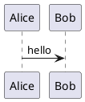
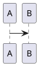

# Smarticky Diagram Rendering Design

Date: 2026-06-22
Status: Proposed

## Summary

Smarticky should support Mermaid, PlantUML, and drawio diagrams in Markdown notes without turning the app into a full document-rendering platform. The first implementation stage focuses on Web rendering and front-end share image export. MCP-generated PNG images keep their current text-only Go renderer and explicitly do not promise diagram rendering in this stage.

The design borrows the architectural lesson from `/home/czyt/code/go/markdown-viewer-extension`: diagram rendering needs a small plugin/renderer boundary, asynchronous completion, and export-aware DOM output. It should not copy that repository's implementation code because it is a much larger cross-platform renderer and is licensed as GPL-3.0-only.

## Goals

- Render fenced Markdown diagram blocks for `mermaid`, `plantuml` / `puml`, and `drawio`.
- Preserve the note content as Markdown source; diagrams are a rendering concern, not a storage format change.
- Make front-end share image export wait until diagrams have rendered before calling `html-to-image`.
- Keep rendered diagrams readable in the editor/share preview and included in downloaded/copied PNG images.
- Show clear inline errors when a diagram cannot render.
- Keep MCP image generation working with its current behavior while documenting that diagram blocks are not rendered by the Go renderer yet.

## Non-Goals

- No full draw.io editor.
- No initial server-side/headless diagram renderer.
- No support for Vega, Graphviz/DOT, Canvas, Slidev, or HTML diagram blocks in this stage.
- No direct code copy from `markdown-viewer-extension`.
- No persisted schema change for notes.

## Current Context

The Svelte app currently renders Markdown through `web/app/src/lib/markdown/render.ts`, using `marked`, `DOMPurify`, and KaTeX. The editor surface stores and edits Markdown through Milkdown/Crepe in `MarkdownEditor.svelte`, while source mode keeps raw Markdown in a textarea.

Front-end share image export is implemented in `ShareImageDialog.svelte` using `html-to-image` over the rendered DOM. This makes it a good first target for diagram export, as long as diagram rendering completes before export begins.

MCP image generation calls `internal/shareimage.Service.Generate`, which uses a Go image canvas and a `stripMarkdown`-style text layout. That renderer cannot include SVG/HTML diagrams without a larger architecture change. For this stage, it remains text-only.

## Target Model

Introduce a small front-end diagram rendering layer under the Markdown renderer:

```text
Markdown source
  -> marked renderer extension detects supported fenced code blocks
  -> emits diagram placeholders with escaped source payload
  -> Svelte action/component resolves placeholders asynchronously
  -> renderer returns safe SVG/HTML DOM
  -> share image export waits for diagram settle state
```

The renderer boundary is intentionally narrow:

```ts
type DiagramType = "mermaid" | "plantuml" | "drawio";

interface DiagramRenderRequest {
  type: DiagramType;
  source: string;
  theme: "light" | "dark";
}

interface DiagramRenderResult {
  html: string;
  width?: number;
  height?: number;
}

interface DiagramRenderer {
  type: DiagramType;
  render(request: DiagramRenderRequest): Promise<DiagramRenderResult>;
}
```

The implementation can refine these names, but the contract should stay equivalent: one input source, one diagram type, one safe DOM result, one consistent error path.

## Format Handling

Supported fences:

````markdown






```drawio
<mxfile>...</mxfile>
```
````

Unsupported diagram-like fences remain normal code blocks. Empty supported diagram blocks render as normal code blocks rather than an error.

## Renderer Strategy

Mermaid is first because it is the most common flowchart path and has the clearest browser-side rendering story. It should render SVG into a `.diagram-block` wrapper and avoid auto-start behavior that scans the whole page.

PlantUML is second. The preferred stage-one behavior is local/offline browser rendering if a suitable package is approved during implementation. A remote PlantUML server must not be the default because notes may contain private content.

drawio is third. Stage one supports drawio XML source inside fenced code blocks and renders it to SVG/HTML. It does not provide an editor or import workflow beyond the fenced XML content.

All selected renderer packages must be reviewed for license compatibility before implementation. The package choice is part of the implementation plan, not hidden inside the design.

## Data Flow

1. User writes Markdown with a supported diagram fence.
2. `renderMarkdown()` emits sanitized HTML with diagram placeholders.
3. A diagram runtime scans only inside the rendered Markdown root.
4. Each placeholder is replaced with a rendered diagram or an inline error block.
5. The share dialog observes a diagram settle promise/count before enabling copy/download.
6. `html-to-image` captures the final DOM, including SVG/HTML diagrams.

## Share Image Export

`ShareImageDialog.svelte` should not call `toPng()` or `toBlob()` until diagrams in `.share-preview__markdown` have settled. The UI can reuse the existing busy state and disable export buttons while diagrams are still rendering.

Failure policy:

- If a diagram fails to render, the error block is captured into the image.
- Export should not fail solely because one diagram is invalid.
- Export should fail only if the capture target is missing or `html-to-image` itself fails.

## MCP Behavior

MCP image generation remains backed by `internal/shareimage/service.go` in this stage. It strips Markdown and renders text only. Diagram fences may appear as plain text-derived content or be stripped by future cleanup, but they are not rendered as diagrams.

The MCP tool description should be updated so callers do not infer unsupported behavior:

> Generate a PNG share image from an owned note or explicit title/content. Markdown diagrams are not rendered in MCP images yet.

This keeps the public contract honest while avoiding a large server-side rendering dependency before the Web path proves useful.

## Security

- Diagram source is untrusted user input.
- Placeholder payloads must be escaped and never injected as executable HTML.
- Rendered output must be sanitized before insertion unless the renderer produces DOM through controlled APIs.
- External network calls are not allowed for diagram rendering by default.
- drawio XML must not be allowed to execute scripts, load remote resources, or inject event handlers.
- PlantUML rendering must not send note content to a public rendering service by default.

## Error Handling

Each failed diagram renders an inline block with:

- diagram type
- short error message
- no stack trace
- source hidden by default or shown only as escaped code if the surrounding UI already exposes source

The rest of the note continues rendering.

## UI Behavior

Diagram blocks should have stable layout:

- constrained max width
- horizontal scrolling or fit-to-container for large diagrams
- readable background in light and dark themes
- optional click-to-open lightbox deferred to a later polish pass

No new toolbar buttons are required for the first implementation. Users can insert diagram fences manually through source mode or Markdown editing.

## Testing

Focused tests should cover:

- `renderMarkdown()` keeps normal code blocks unchanged.
- Supported fences emit diagram placeholders rather than executable source.
- Empty diagram fences fall back safely.
- Invalid diagram source shows an error block without breaking the note.
- Share image export waits for diagram settle before invoking capture.
- Export still proceeds when one diagram has an inline error.
- MCP image generation behavior remains unchanged except for documented wording.

Manual verification should include:

- Mermaid flowchart in a note renders in Web UI.
- PlantUML sequence diagram renders in Web UI.
- drawio XML renders in Web UI.
- A share PNG downloaded from the browser includes the rendered diagrams.
- MCP `smarticky_generate_note_image` still returns a PNG and does not claim diagram support.

## Rollout Plan

1. Add the diagram rendering boundary and placeholder flow.
2. Implement Mermaid renderer and tests.
3. Wire share export waiting.
4. Implement PlantUML renderer and tests.
5. Implement drawio renderer and tests.
6. Update MCP tool description and README feature notes.
7. Run front-end checks, Go tests, and manual image export verification.

## Open Decisions Resolved

- MCP diagram rendering is deferred.
- The first supported formats are Mermaid, PlantUML, and drawio only.
- The note database schema does not change.
- The implementation should learn from the reference renderer architecture but not copy its code.
